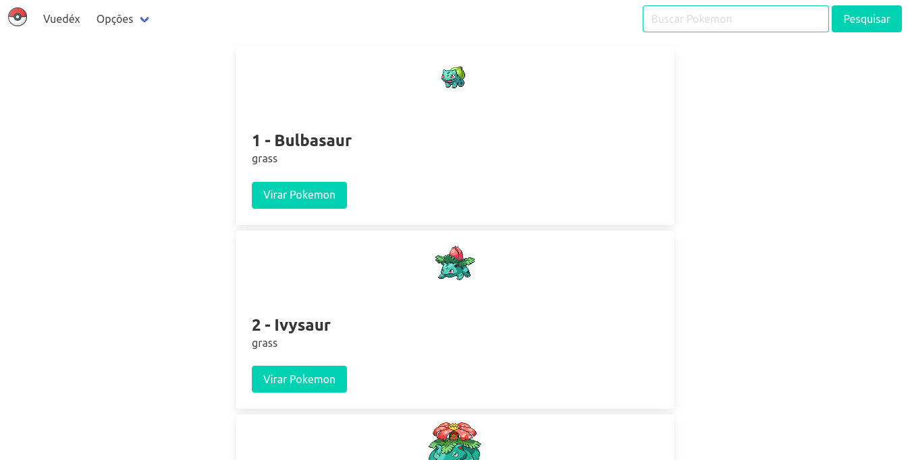

# Vuedex

<div style="margin: 0 auto; text-align: center;">  
  
  
  
  
  
  
</div>




> Pokedex feita inteiramente com VueJS, NodeJS, Bulma e PokeAPI
### Ajustes e melhorias

As seguintes melhorias ainda estão em aberto:

- [ ] Construção de páginas de erro
- [ ] Desenvolvimento de documentação
- [ ] Desenvolvimento de sistema de *logs*
- [ ] Melhorias na interface

## 💻 Pré-requisitos

Antes de começar, verifique se você atendeu aos seguintes requisitos:

* Você instalou a versão mais recente de `NodeJS`, `Git` e `Visual Studio Code` ou outra IDE de preferência.
* Você tem uma máquina da sua preferência. De preferência sistemas baseados em `Debian 10`.
* Você tem familiaridade com `Desenvolvimento back e front-end` e outras tecnologias adicionais.

## 🚀 Instalação

Para instalar, siga estas etapas:

Linux, Windows e macOS:
``` 
git clone https://github.com/eng-gabrielscardoso/vuedex.git
```

> Verifique se possui permissões para clonar o repositório com o administrador do projeto
## ☕ Utilização

Para usar, siga estas etapas:

1. Primeiramente, verifique se todos os requisitos previamente explicitados foram atendidos. Instale as depedências, tecnologias e tenha, especialmente, o projeto rodando em uma máquina Linux.
   
2. Crie um arquivo ```.env``` na raiz do projeto, contendo as seguintes variáveis de ambiente:
   
```
PORT= // Porta de preferência
VUE_APP_TITLE=Vuedex // Ou o título de preferência
VUE_APP_API_URL=https://pokeapi.co/api/v2/ // Os detalhes devem ser consultados na documentação da API
```


## 📫 Contribuição

Para contribuir com projeto Perguntas e Respostas, siga estas etapas:

1. Bifurque este repositório.
2. Crie um branch: `git checkout -b <descrição_sucinta>`.
3. Faça suas alterações e confirme-as: `git commit -m '<mensagem_commit>'`
4. Envie para a branch de homologação: `git push origin <nome_do_projeto> / <local>`
5. Crie a solicitação de pull.

Como alternativa, consulte a documentação do GitHub em [como criar uma solicitação pull](https://help.github.com/en/github/collaborating-with-issues-and-pull-requests/creating-a-pull-request).

## 🤝 Colaboradores

Agradecemos às seguintes pessoas que contribuíram para este projeto:

<table>
  <tr>
    <td align="center">
      <a href="#">
        <br>
        <sub>
          <b>Gabriel Cardoso</b>
        </sub>
      </a>
    </td>
  </tr>
</table>


## 😄 Seja um dos contribuidores<br>

Quer fazer parte desse projeto? Clique [AQUI](./docs/README.md) e leia como contribuir.

## 📝 Licença

Esse projeto está sob licença. Veja o arquivo [LICENÇA](LICENCE) para mais detalhes.

[⬆ Voltar ao topo](#vuedex)<br>